# qviz_demo

## 🔔 重要事项

> 本仓库提供的 ROS 包的相关专栏详见《[Qt+librviz开发](https://blog.csdn.net/ymgogre/category_12299946.html)》专栏，专栏包含了前期环境配置的相关介绍等**关键**先决条件文章。

### 💬 更改功能包名称

如果您需要更改功能包的名称:

- 使用文本编辑器的查找与替换功能替换 `cmakelist.txt` 与 `package.xml` 中的 "qviz_demo" 为自己想要的名称；
- 更改 **include** 目录下的文件夹名称为自己的功能包名称；
- 使用代码编辑器的查找和替换功能替换项目中的 .h/.hpp 以及 .cpp 文件代码中可能包含的 "qviz_demo" 为自己想要的名称(包含 **include**、**src**、**OtherWidget** 目录下)；

### 💬 文件夹说明

- **CustomControl** 文件夹为用户自定义控件源码；
- **OtherWidget** 文件夹为该 Demo 软件需要使用到的其他辅助窗口（比如对话框窗口）的源文件夹；

---

# 1、笔者的运行环境

* [Ubuntu 20.04.6 LTS](https://www.releases.ubuntu.com/focal/)
* [ROS Noetic LTS](http://wiki.ros.org/noetic)
* [Qt 6.2.4 LTS](https://doc.qt.io/qt-6.2/)

# 2、Demo 软件介绍

## 2.1、启动 ROS Master

`ctrl+alt+T` 打开一个终端，并使用如下命令启动 ROS Master：
```bash
roscore
```

## 2.2、下载并运行软件

1. 下载或克隆此 ROS 包到您的工作空间的 **src** 文件夹目录下，比如 `/home/用户名/workspace/catkin_ws1/src`；
2. 回到 **src** 文件夹所在目录，在当前目录下打开一个终端，使用 `catkin_make` 命令构建项目；

    > 📌 <font color="#008000">**安装 map_server 包**</font>
    >
    > 在构建项目之前，您可能需要先下载 ROS 地图服务（<font color="#ff4500">**map_server**</font>）包，因为本仓库提供的 ROS 包需要用到 map_server。使用如下命令以安装包：
    > 
    > ```bash
    > sudo apt-get update
    > sudo apt-get install ros-noetic-map-server    # 请注意，您的 ROS 版本是否为 Noetic？
    > ```

3. 完成后，在同一个终端内输入如下命令以运行 Demo：

    ```bash
    cd devel/lib/qviz_demo
    # 运行 Demo
    ./qviz_demo
    ```
    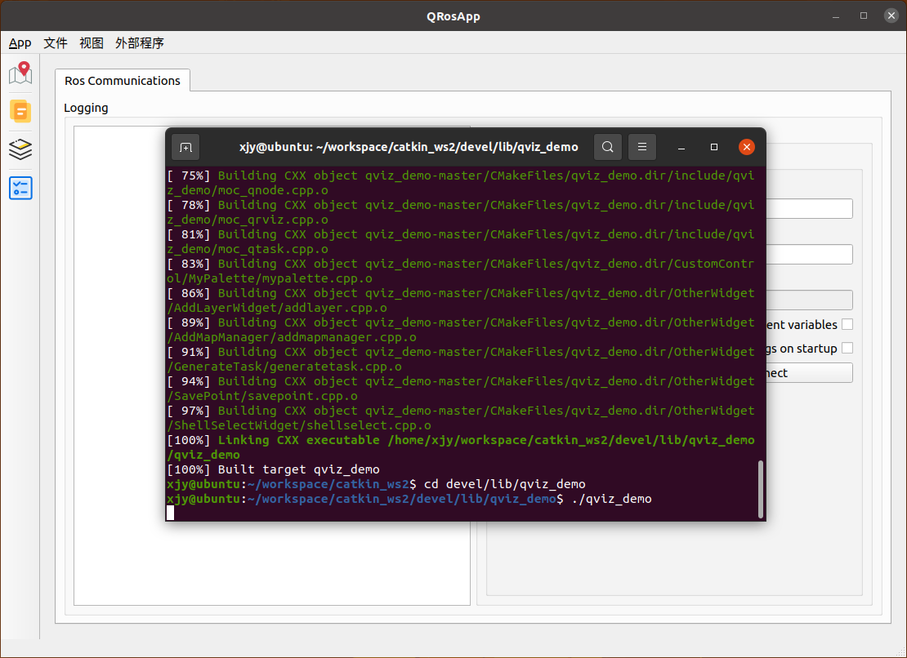

4. 由于我们是在本地启动的 ROS Master，所以我们设置 ROS Master 的 IP 为 `127.0.0.1`，端口号 `11311`；设置 ROS 包程序的 IP 为 `127.0.0.2`。连接到 ROS Master：<br>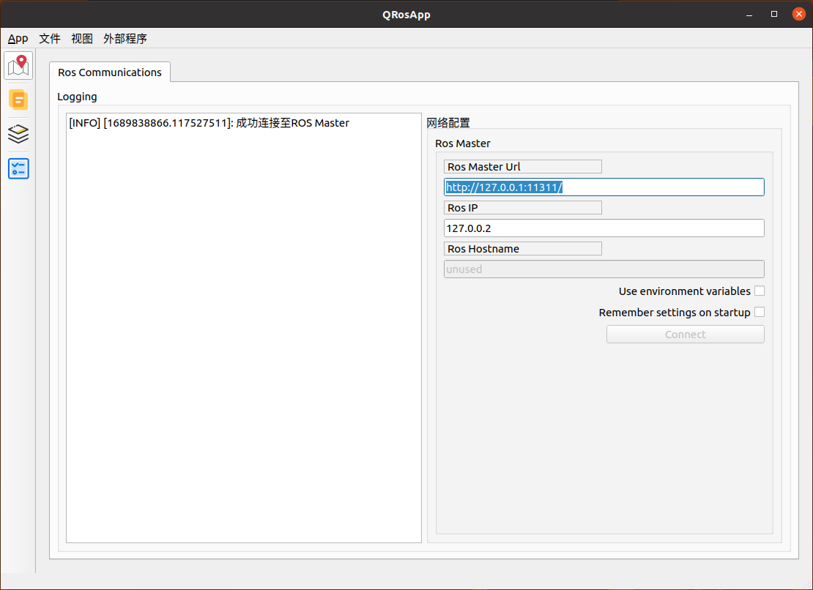
5. 布局介绍：<br>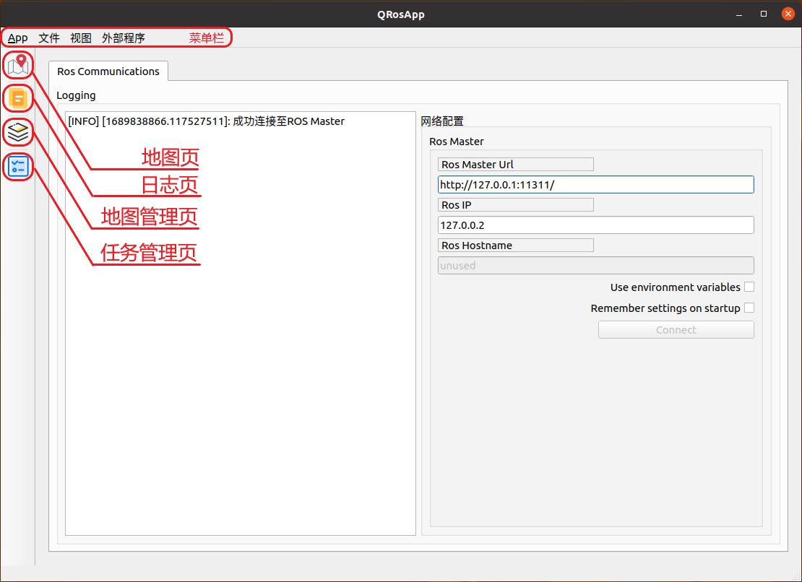

## 2.3、菜单栏介绍

菜单栏一共只有四个菜单项：

<dl>
<dt>App</dt>
<dd>仅能查看一些相关信息以及退出程序。</dd>
<dt>文件</dt>
<dd>仅能用于打开地图（*.yaml）文件。</dd>
<dt>视图</dt>
<dd>包含两个子菜单项，仅能用于打开 <strong><em>地图页</em></strong> 的两个停靠窗口。</dd>
<dt>外部程序</dt>
<dd>仅用于启动 <a href="http://wiki.ros.org/rviz">Rviz</a> 和外部的 Shell 脚本，使用方法请参考《<a href="https://blog.csdn.net/YMGogre/article/details/128973098#t6">在基于Qt的应用程序中启动外部Shell脚本的两种方法</a>》</dd>
</dl>

## 2.4、地图页布局介绍

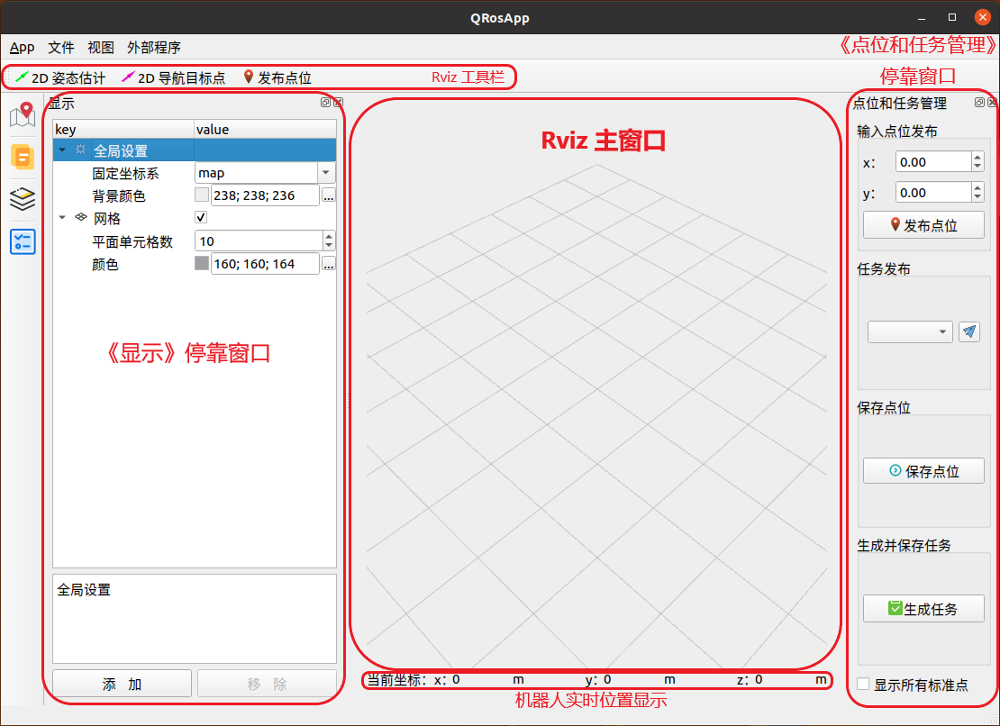

相信曾经使用过 [Rviz](http://wiki.ros.org/rviz) 的小伙伴一定对 ***地图页*** 不陌生，地图页其实就是对 Rviz 主页面的简单复刻。但 ***地图页*** 十分“简陋”，仅实现了 Demo 中需要用到的 Rviz 功能：

<dl>
<dt>Rviz 工具栏</dt>
<dd>仅实现了三个 Rviz 工具，功能与原版一致。</dd>
<dt>《显示》停靠窗口</dt>
<dd>管理 Rviz 主窗口显示的可视化对象属性。点击“添加”按钮可以查看 Demo 支持的所有显示类型。</dd>
<dt>Rviz 主窗口</dt>
<dd>Rviz 三维可视化主窗口。</dd>
<dt>《点位和任务管理》停靠窗口</dt>
<dd>用于管理单个地图的点位和任务（所谓“任务”，您可以简单看作就是一条路径）。</dd>
<dt>机器人实时位置显示</dt>
<dd>使用 <a href="https://zhuanlan.zhihu.com/p/456831527">TF 树</a>获取机器人在地图坐标系下的三维实时位置。方法原型位于 <a href="https://github.com/YMGogre/qviz_demo/blob/master/src/qnode.cpp#L345"><code>qnode.cpp</code></a>：

```cpp
//您可以在源码文件 `qnode.cpp` 中找到该方法定义
bool QNode::get_curr_robot_pose(geometry_msgs::PoseStamped& global_pose, tf2_ros::Buffer& tf_)
```
</dd>
</dl>

## 2.5、地图管理页面布局介绍

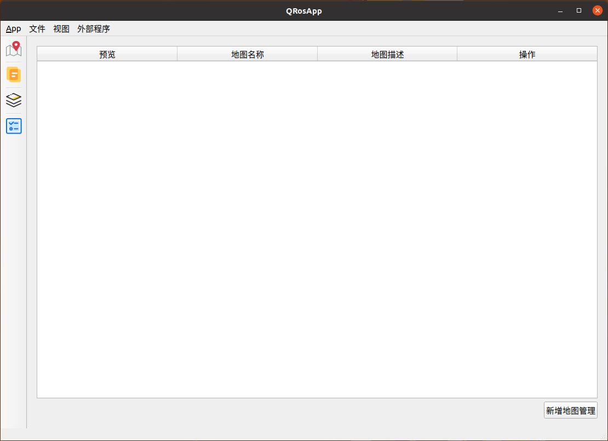

地图管理页非常简单：一张空白表格和右下角的“**新增地图管理**”按钮。<font color="#008000">*您可以使用该页面在 Demo 程序中托管二维激光雷达 SLAM 扫描并保存得到的的 2d 地图文件（`*.pgm` 和 `*.yaml`）*</font>。

点击右下角的“**新增地图管理**”按钮，在打开的对话框中您需要检索地图文件路径并自行拟定地图的名称和描述，再点击确认即可成功添加管理。

> 📌 <font color="#008000">**尝试一下！**</font>
> 
> 在本仓库的 [**Maps**](https://github.com/YMGogre/qviz_demo/tree/master/Maps) 文件夹下存放了一个仿真 2d 地图文件，您可以尝试使用地图管理页添加对该仿真地图的管理，成功后应当如下所示：<br>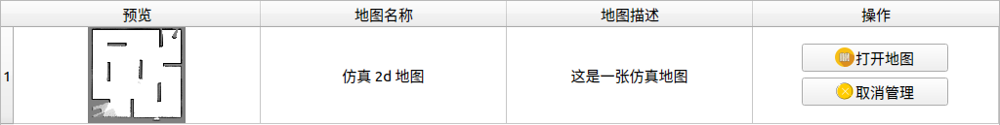
>
> 成功添加管理后，您可以在此页面继续点击“<font color="#ffcc00">**取消管理**</font>”按钮以取消 Demo 程序对地图文件的托管；或者点击“<font color="#f7be15">**打开地图**</font>”按钮，Demo 会运行 ROS 地图服务发布该地图并自动跳转到 ***地图页***。相当于自动执行了如下这条命令：
> 
> ```bash
> rosrun map_server map_server 地图文件名.yaml
> ```
>
> 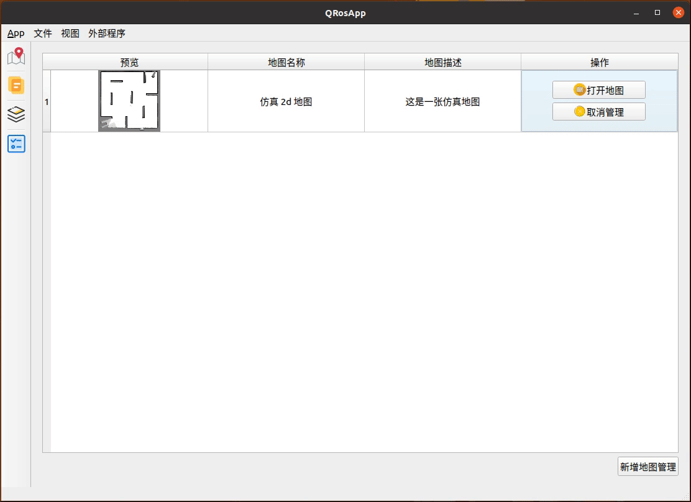

> 💬 当然，您也可以通过菜单栏的“***文件***”选项打开一张地图。

## 2.6、任务管理页布局介绍

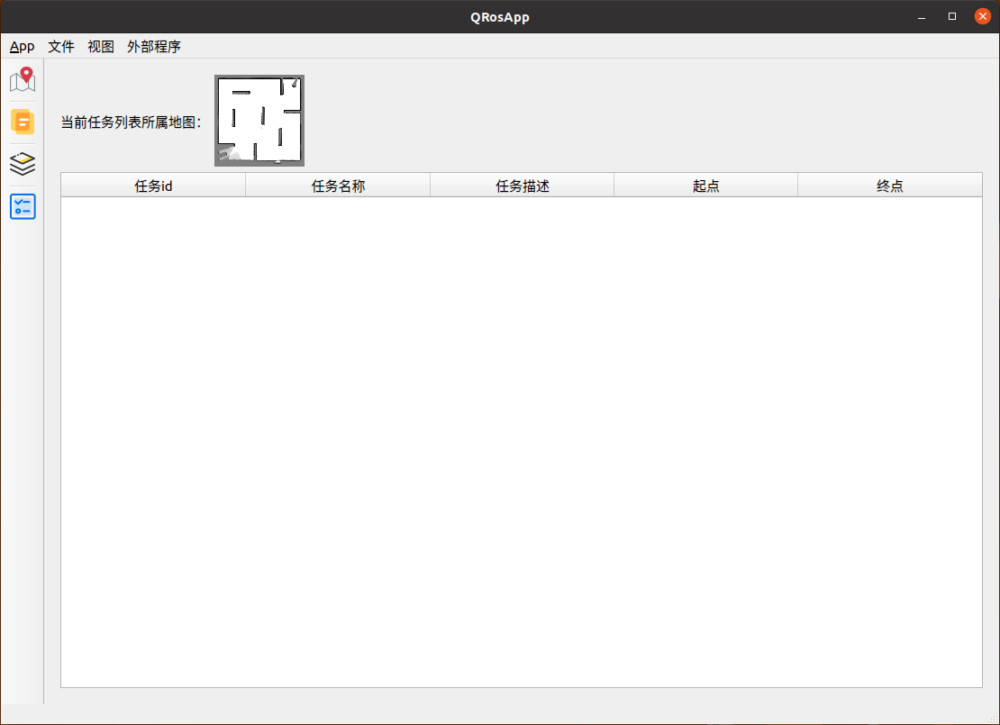

该页没有提供任何可交互途径，仅展示属于该地图的任务（所谓“任务”，您可以简单看作就是一条路径）。

# 3、使用说明

## 3.1、打开地图

您可以通过菜单栏的“***文件***”选项或者详见 [2.5 小节](#25地图管理页面布局介绍)的方式打开一张地图。

> 📌 <font color="#008000">**地图文件路径？**</font>
>
> 使用本 Demo 程序打开一张地图时，程序会将 `*.yaml` 文件所在路径保存到 [ROS 参数服务器](http://wiki.ros.org/Parameter%20Server)，参数名为 `/yaml_file_path`。您可以使用如下命令罗列当前所有的参数：
> 
> ```bash
> rosparam list
> ```
>
> <div align="center">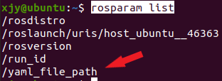</div><br>此外，您还可以使用如下命令获取该参数的值：
> 
> ```bash
> rosparam get /yaml_file_path
> ```

## 3.2、发布点位

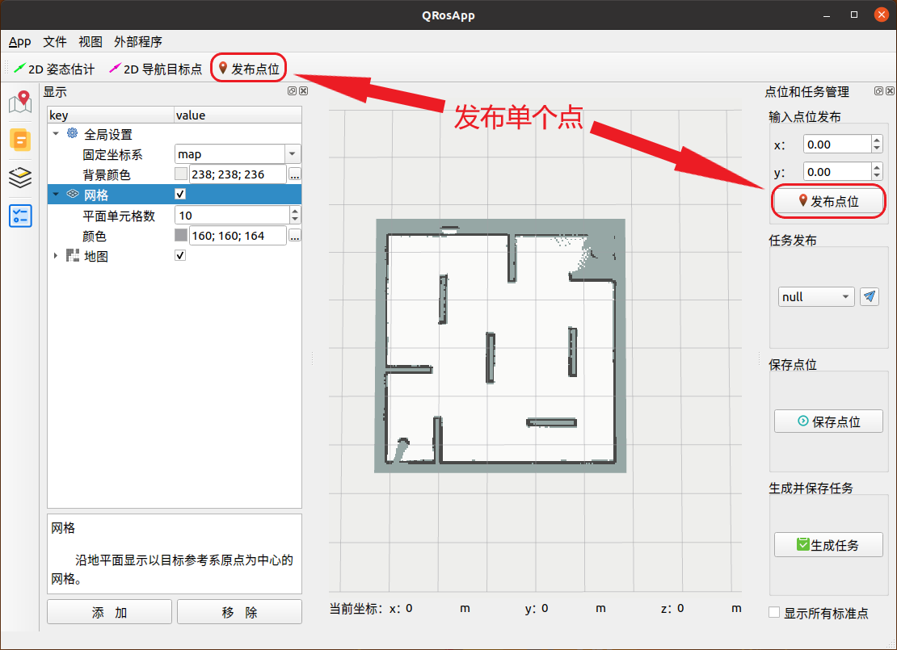

在 ***地图页***，可以找到两个“<font color="#9b4726">**发布点位**</font>”按钮，这两个按钮都是用于发布单个点的。它们的区别在于：
* 位于 ***Rviz 工具栏*** 的“<font color="#9b4726">**发布点位**</font>”按钮用于使用鼠标在地图上点一个点发布；
* 位于 ***《点位和任务管理》停靠窗口*** 的“<font color="#9b4726">**发布点位**</font>”按钮用于键盘在地图坐标系下输入点位坐标发布。
> 💬 若想要显示发布的点位，您需要新增一个【[带点戳(Point Stamped)](http://wiki.ros.org/rviz/DisplayTypes/Point)】图层并订阅 `/clicked_point` 话题。点击 ***《显示》停靠窗口*** 左下角的“**添加**”按钮以添加图层。

## 3.3、保存点位

> 📌 <font color="#ff4500">**先决条件！**</font>
>
> 在使用 <font color="#20b0ad">**保存点位**</font> 功能前，笔者推荐如果您已经使用本 Demo 程序[打开了一张地图](#31打开地图)。因为点位并不是凭空存储的，它需要与地图建立绑定关系。此外，笔者并不推荐您在本 Demo 程序外使用命令行启动 `map_server` 服务发布地图，因为那样 Demo 程序将无法分辨地图文件所在路径。

位于 ***《点位和任务管理》停靠窗口*** 的“<font color="#20b0ad">**保存点位**</font>”按钮可以用于保存 <font color="#9b4726">**已发布的点位**</font> 或者是机器人的 <font color="#b9e7dd">**实时位置信息**</font>：<br><div align="center">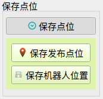</div>

* 无论是保存 已发布的点位 还是机器人的 实时位置信息，点位信息都会以 **Json** 文件格式存储。Json 文件的默认存储位置与地图文件（`*.pgm` 和 `*.yaml`）处于同一目录下；文件名称为 **地图文件名称 + "Point"**：<br>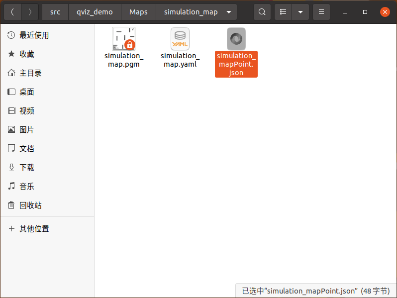
* 保存点位需要自行拟定点位的名称：<br><div align="center">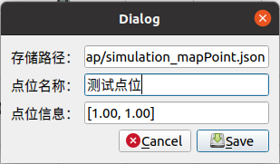</div>

    > Demo 程序并不检查点位重名，也不检查重复保存；也就是说，您可以使用同一个名称多次保存同一个点位。

* 保存发布点位的前提是您已经发布过一个点了；
* 保存机器人位置的前提是 Demo 软件已经可以实时显示机器人位置数据了。

## 3.4、显示已保存的点位

所有已保存的点都是作为 “*标准点* ” 存储的，您可以通过 ***《点位和任务管理》停靠窗口*** 最下方的“**显示所有标准点**”复选框勾选显示所有已保存的点位，在地图中显示为<font color="#ff0000">红色</font>正方形：<br>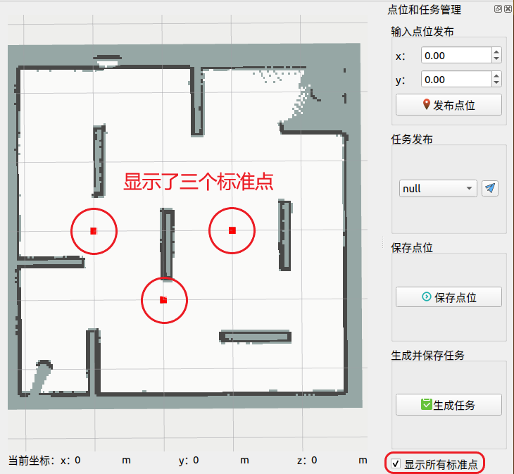

## 3.5、生成并保存任务

我们可以使用 Demo 程序生成任务。点击 ***《点位和任务管理》停靠窗口*** 的“<font color="#66c23a">**生成任务**</font>”按钮以创建一条路径并保存为任务：<br><div align="center">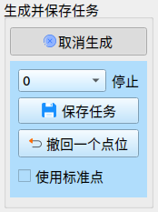</div>
* 创建路径是通过“<font color="#9b4726">[**发布点位**](#32发布点位)</font>”工具完成的；
* 第一个下拉框包含了五个数字（1、-1、30、-30、0），用于指定用户即将创建的新的一段路径的**行进方式**（前进/后退/左移/右移/停止）。这五个数字也是后续保存到任务文件中的数字；

    > 📌 <font color="#008000">**为什么是这五个数字？**</font>
    >
    > 为什么是使用这五个数字指定行进方向呢？这其实跟笔者实际使用该 Demo 程序的场景有关，在笔者使用的场景 PLC 就是需要接收这五个数字中的一个用于控制电机的旋转方向。所以小伙伴们可以根据自己的实际使用场景需要更改 Demo 程序的源码。

* 显然，发布第一个点的时候是不会有任何路径生成的，毕竟两点才能确定一段线段。所以在发布第一个点的时候，我们无需在意“**行进方式**”下拉框的值，Demo 程序也不会采纳它的值：<br>
* 在发布第二个点之前，我们需要指定第一个发布点到第二个发布点的**行进方式**，您需要在确定行进方式后再发布第二个点。后续也是如此：<br>
* “<font color="#ff6900">**撤回一个点位**</font>”按钮允许您撤回最近的一次点位发布，直至不再有任何已发布的任务路径点：<br>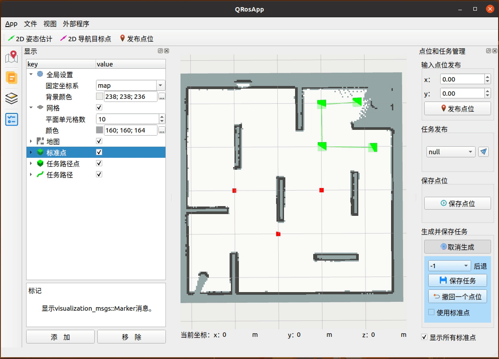
* “**使用标准点**”复选框允许您将任务路径点发布至标准点位置。勾选该复选框后，再使用“<font color="#9b4726">**发布点位**</font>”工具发布任务路径点时，点位会被发布在离鼠标点击位置线性距离最近的一个标准点处：<br>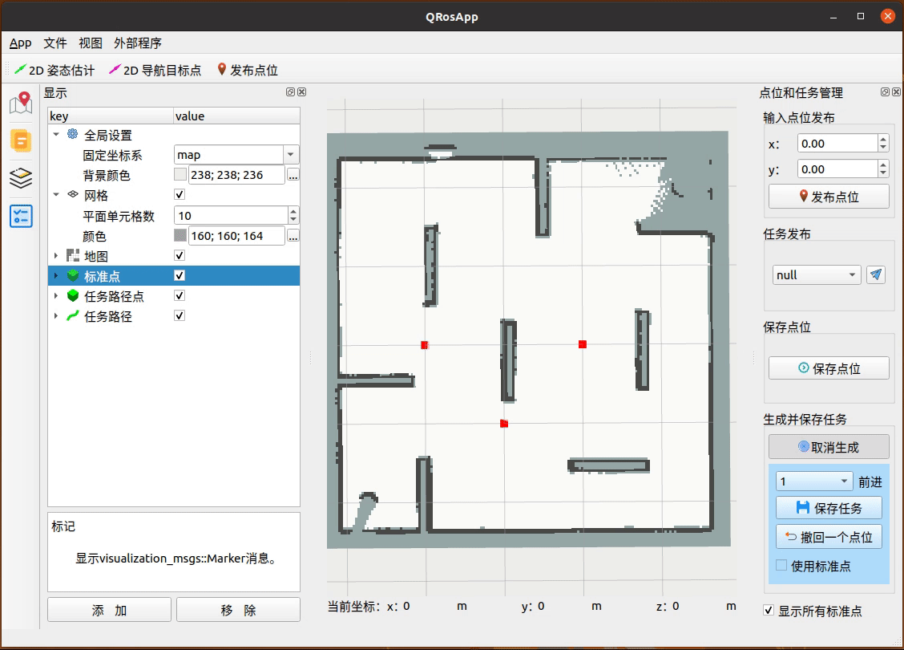
* 在创建完一整条任务路径后，我们就可以使用“<font color="#1890ff">**保存任务**</font>”按钮保存我们创建的任务路径了。在新打开的对话框中，我们需要指定 *任务名称* 和 *任务描述*：<br>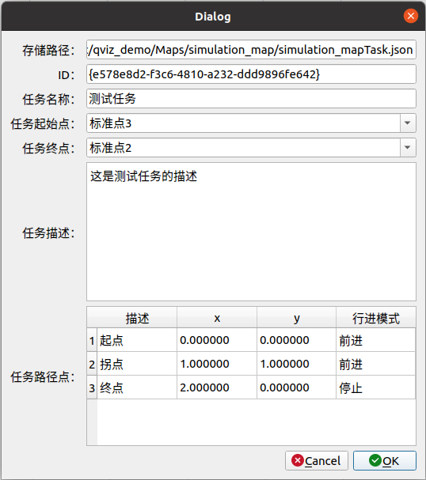

    > * *任务路径点* 分为 *起点*、*拐点* 和 *终点*；点与点之间的路径连线段需要指定行进方式。
    > * 如果任务路径的 *起始点* / *终点* 是已经保存过的“标准点”，则会自动填写标准点的名称；否则需要自行填写。 

* 任务信息会以 **Json** 文件格式存储。Json 文件的默认存储位置与地图文件（`*.pgm` 和 `*.yaml`）处于同一目录下；文件名称为 **地图文件名称 + "Task"**：<br>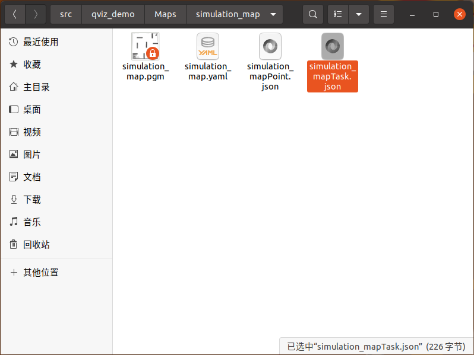
* 保存任务的前提是您已经创建过一条路径了。

## 3.6、发布保存的任务路径

在我们[生成并保存任务](#35生成并保存任务)后，我们可以发布已保存的任务路径。使用 ***《点位和任务管理》停靠窗口*** 的“**任务发布栏**”以发布我们的任务路径：

1. 左侧下拉框选择要发布的任务名称，您可以在 RViz 场景内预览任务路径：<br>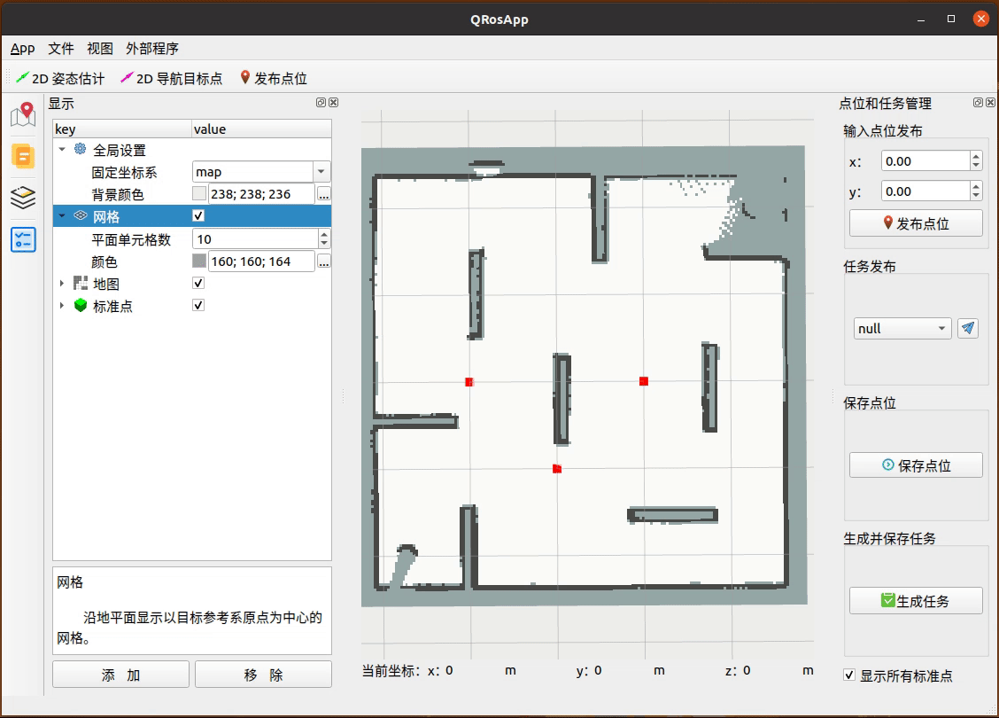
2. 点击右侧的“<font color="#53affd">**纸飞机**</font>”图标按钮以发布该任务路径：<br>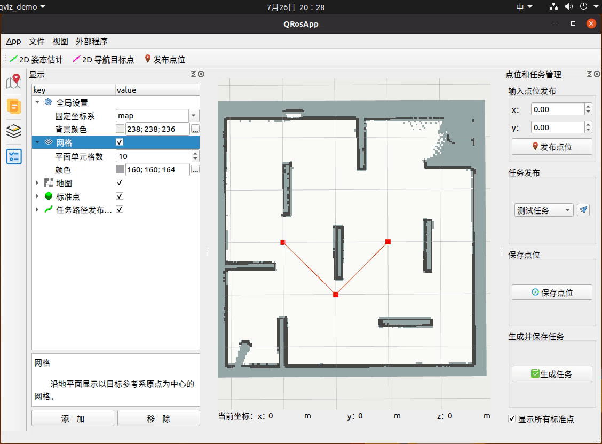

    > 任务路径将会被发布到名为 `/task_path` 的话题下，您可以使用如下命令打印该话题内容：
    > ```bash
    > rostopic echo /task_path
    > ```
    > 
    > 或者直接使用本 Demo 程序添加【[路径(Marker)](http://wiki.ros.org/rviz/DisplayTypes/Marker)】图层并订阅相关话题显示。